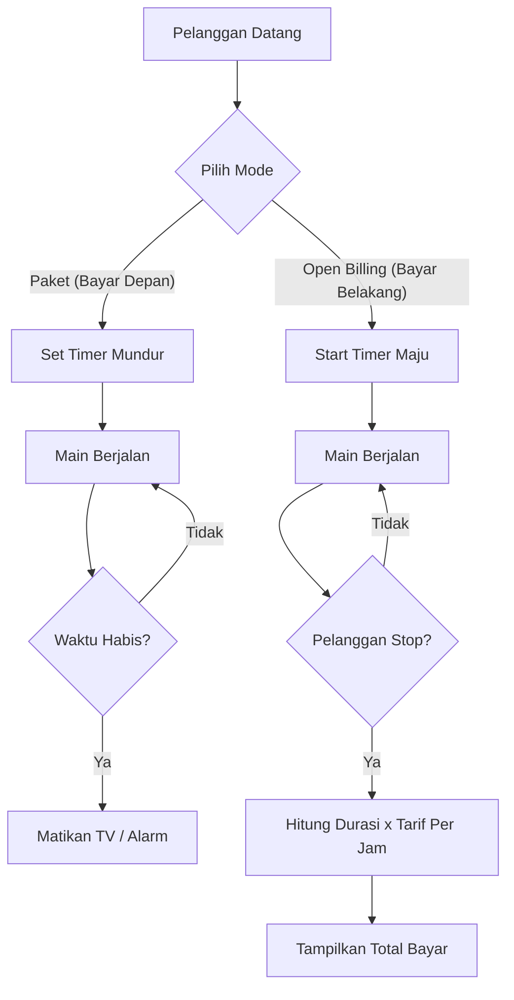

import Callout from '@/components/Callout.astro'

## Lebih dari Sekadar Menghitung Jam

Rental PlayStation adalah bisnis klasik di Indonesia. Namun, banyak pemilik rental masih mencatat waktu main di buku tulis atau kertas sobekan. Masalahnya klise: **Human Error**.

Salah catat jam masuk, lupa menghitung diskon member, atau bingung saat pelanggan minta "tambah paket 1 jam lagi".

Sebagai Tugas Akhir mata kuliah **Algoritma Pemrograman**, saya menciptakan **AGS Billing** (awalnya bernama *agsplaystation*) untuk mendigitalkan proses manual tersebut.

## Mengapa C# dan .NET?

Berbeda dengan aplikasi web yang butuh browser, aplikasi billing butuh performa **Desktop Native**.

*   **Stabilitas:** C# berjalan sangat stabil di lingkungan Windows. Tidak ada istilah "loading page" atau "refresh".
*   **Presisi:** Menghitung durasi hingga detik membutuhkan timer sistem yang akurat, sesuatu yang sangat mudah dilakukan dengan .NET Framework.


## Logika di Balik Kode (Algoritma Tarif)

Tantangan terbesar project ini bukanlah membuat tombol, melainkan **Algoritma Tarif**. Bagaimana komputer memutuskan berapa yang harus dibayar?

Berikut adalah diagram alur logika billing yang berjalan setiap detik:



### Fitur Utama
1.  **Real-time Timer:** Menggunakan komponen `System.Windows.Forms.Timer` yang berdetak setiap 1000ms (1 detik) untuk memperbarui durasi dan biaya secara *live*.
2.  **Manajemen Member:** Logika database sederhana untuk menyimpan data pelanggan setia dan memberikan harga khusus.
3.  **Laporan Harian:** Menghitung total pendapatan hari itu secara otomatis.

<Callout type="info" title="Pelajaran Algoritma">
  Project ini mengajarkan saya tentang **State Management**. Bagaimana status PC/TV berubah dari `Idle` -> `Active` -> `Paused` -> `Finished`. Setiap perubahan status memicu logika tarif yang berbeda.
</Callout>

## Struktur Project (Visual Studio)

```text
AGSBILLING/
├── AGSBILLING.sln          # Solution File
├── AGSBILLING/
│   ├── Program.cs          # Entry Point (Main Function)
│   ├── Form1.cs            # Logika UI Utama (Timer & Tombol)
│   ├── Form1.Designer.cs   # Kode Auto-generate UI
│   └── Classes/
│       ├── BillingLogic.cs # Rumus hitung duit ada di sini
│       └── Member.cs       # Class Objek Member
└── bin/Debug/              # Hasil Compile (.exe)
```

## Evolusi Project

Awalnya project ini hanya berupa kode C++ sederhana di terminal hitam putih. Namun, saya menantang diri sendiri untuk memporting-nya ke **C# Windows Forms (GUI)** agar layak digunakan oleh manusia biasa, bukan cuma programmer.

Transisi dari *Console* ke *GUI* mengajarkan saya tentang *Event-Driven Programming* (kode yang berjalan hanya saat tombol diklik), berbeda dengan *Procedural Programming* (kode jalan dari atas ke bawah) yang biasa diajarkan di awal kuliah.

## Kesimpulan

**AGS Billing** adalah bukti bahwa logika pemrograman dasar (Looping, If-Else, Variable) bisa menjadi solusi bisnis nyata jika dikemas dengan antarmuka yang tepat. Ini adalah langkah pertama saya memahami bagaimana *Software Engineering* bekerja di dunia desktop.
