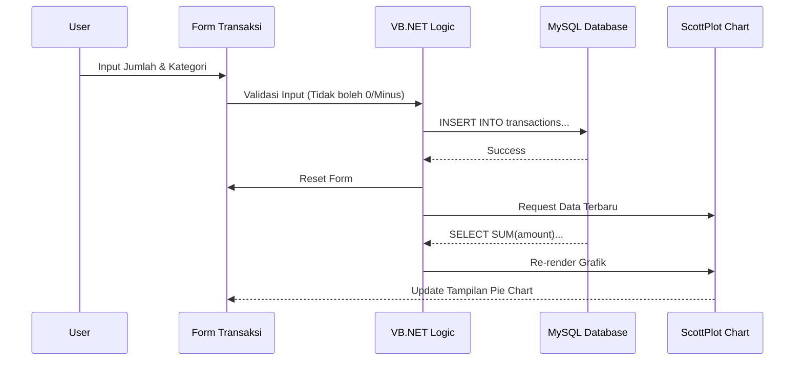
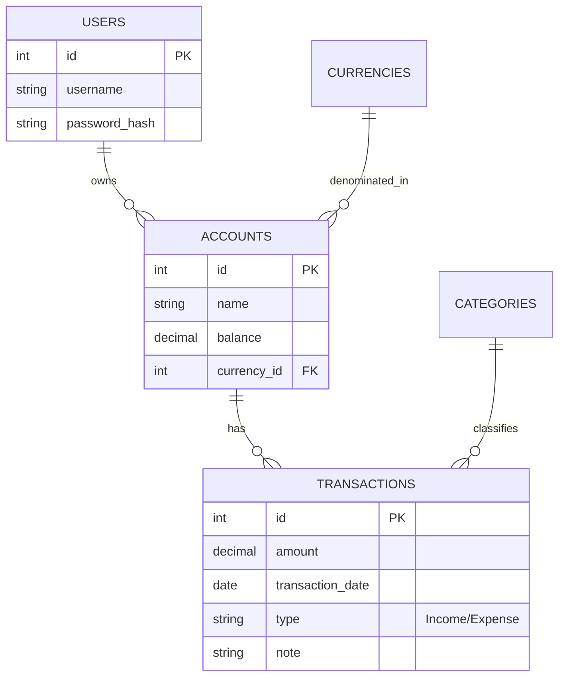

import Callout from '@/components/Callout.astro'

## Mengapa BudgieVB?

Kebanyakan aplikasi keuangan terlalu rumit atau justru terlalu simpel. **BudgieVB** (Budgie Visual Basic) lahir dari kebutuhan tugas akhir mata kuliah **Pemrograman Visual** untuk menciptakan aplikasi desktop yang *robust* namun tetap intuitif.

Aplikasi ini tidak sekadar mencatat pengeluaran, tapi juga membantu Anda memvisualisasikan kesehatan finansial melalui grafik yang *real-time*.


## Arsitektur & Alur Kerja

Agar Anda paham cara kerjanya, mari kita bedah "otak" aplikasi ini. BudgieVB menggunakan arsitektur event-driven khas Windows Forms yang terhubung ke database MySQL lokal.

### 1. Diagram Alur Data (Data Flow)

Berikut adalah perjalanan data saat Anda mencatat transaksi baru:



### 2. Struktur Database

Aplikasi ini menggunakan database relasional untuk menjaga integritas data. Tidak ada lagi cerita saldo minus tanpa alasan.



## Bedah Kode & Struktur File

Jika Anda mengunduh repository ini, berikut adalah peta untuk memahami isinya:

```text
BudgieVB/
├── BudgieVB.sln            # File solusi utama (Buka file ini di Visual Studio)
├── budgie.sql              # Script database (IMPORT INI KE PHPMYADMIN!)
└── BudgieVB/               # Folder Source Code
    ├── Forms/              # Semua tampilan GUI ada di sini
    │   ├── frmLogin.vb     # Gerbang masuk aplikasi
    │   ├── frmDashboard.vb # Pusat kendali (Ada ScottPlot di sini)
    │   └── frmAddTx.vb     # Form tambah transaksi
    ├── Modules/
    │   └── Database.vb     # "Jantung" koneksi ke MySQL
    ├── Assets/             # Ikon dan gambar
    └── App.config          # Konfigurasi koneksi DB (Ganti user/pass DB disini)
```

<Callout type="warning" title="Penting untuk Developer">
  File `Modules/Database.vb` adalah file paling krusial. Di sinilah *Connection String* berada. Jika Anda gagal login, cek apakah username/password MySQL di file ini sudah sesuai dengan settingan XAMPP Anda.
</Callout>

## Algoritma Utama: Validasi Saldo

Salah satu logika terpenting dalam aplikasi keuangan adalah mencegah pengeluaran melebihi saldo akun. Berikut pseudocode-nya:

```vb
' Logika saat tombol "Simpan Pengeluaran" ditekan
Function SimpanTransaksi()
    Dim saldoSekarang = GetCurrentBalance(accountID)
    Dim pengeluaranBaru = txtAmount.Text
    
    ' 1. Cek apakah uang cukup
    If pengeluaranBaru > saldoSekarang Then
        ShowError("Saldo tidak cukup! Jangan boros.")
        Return False
    End If
    
    ' 2. Lakukan Transaksi
    ExecuteQuery("INSERT INTO transactions ...")
    
    ' 3. Update Saldo Akun
    Dim saldoBaru = saldoSekarang - pengeluaranBaru
    ExecuteQuery("UPDATE accounts SET balance = " & saldoBaru)
    
    Return True
End Function
```

## Panduan Instalasi (Cara Pakai)

Ingin mencoba aplikasi ini di komputer Anda? Ikuti langkah ini:

1.  **Persiapan Lingkungan:**
    *   Install **Visual Studio 2022** (Pilih workload *.NET Desktop Development*).
    *   Install **XAMPP** (untuk server database MySQL).
    *   Install **MySQL Connector for .NET** (agar VB bisa ngobrol sama MySQL).

2.  **Setup Database:**
    *   Nyalakan Apache & MySQL di XAMPP.
    *   Buka `localhost/phpmyadmin`.
    *   Buat database baru bernama `budgie_db`.
    *   Import file `budgie.sql` yang ada di repository.

3.  **Jalankan Aplikasi:**
    *   Buka `BudgieVB.sln`.
    *   Tekan tombol **Start** (Ikon Play Hijau).
    *   Login dengan user default (jika ada di readme) atau register user baru.

## Pustaka Pihak Ketiga

Saya menggunakan **ScottPlot** karena komponen grafik bawaan Visual Studio (MSChart) sudah terasa kuno dan berat. ScottPlot memungkinkan:
*   Rendering grafik ribuan data dalam hitungan milidetik.
*   Interaktif (bisa di-zoom dan digeser).
*   Tampilan modern dan *flat design*.

## Kesimpulan

BudgieVB mengajarkan saya bahwa aplikasi visual yang baik bukan hanya soal *drag-and-drop* tombol, tapi bagaimana menyusun arsitektur data yang rapi di belakang layar. Sinergi antara **MySQL** (Penyimpanan), **VB.NET** (Logika), dan **ScottPlot** (Visualisasi) menghasilkan aplikasi yang *powerful*.