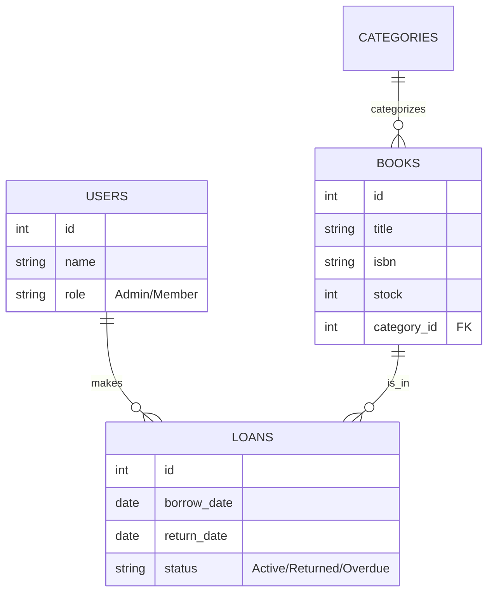

import Callout from '@/components/Callout.astro'

## Masalah: Buku Berserakan, Data Berantakan

Pernahkah Anda mencoba mendata ratusan buku secara manual di Excel? Melelahkan dan rawan salah ketik. Itulah masalah yang coba saya selesaikan dengan proyek **Not Enough Books** ini.

Sebagai tugas akhir mata kuliah Pemrograman Web, saya tidak ingin hanya membuat aplikasi CRUD (*Create, Read, Update, Delete*) yang membosankan. Saya ingin membuat sistem perpustakaan yang **cantik**, **cepat**, dan **pintar**.


## Solusi: Modern & Terotomatisasi

Aplikasi ini dibangun dengan filosofi *"Mobile First"*. Artinya, pustakawan bisa mendata buku lewat HP sambil berjalan di lorong rak buku, tanpa harus duduk di depan komputer kasir yang besar.

### Arsitektur Database (ERD)

Kunci dari sistem perpustakaan adalah relasi antar data. Berikut adalah rancangan database bagaimana sistem menghubungkan Buku, Kategori, dan Peminjaman:



### Fitur untuk Manusia (Bukan Robot)
*   **Pencarian Kilat:** Cari buku berdasarkan judul, penulis, atau ISBN semudah mencari barang di marketplace.
*   **Sampul Otomatis:** Sistem didesain untuk menampilkan sampul buku secara visual, bukan cuma daftar teks membosankan.
*   **Sistem Peminjaman:** Mencatat siapa meminjam apa, dan kapan harus kembali.

## Struktur Project (Laravel)

Bagi Anda yang ingin mempelajari kodenya, berikut adalah peta direktori penting dalam proyek ini:

```text
not-enough-books/
├── app/
│   ├── Models/         # Representasi data (Book.php, User.php)
│   └── Http/Controllers/ 
│       ├── BookController.php  # Logika pendataan buku
│       └── LoanController.php  # Logika peminjaman
├── database/
│   └── migrations/     # Blueprint database (Skema tabel)
├── resources/
│   └── views/          # Tampilan (Blade Templates + DaisyUI)
├── routes/
│   └── web.php         # Peta jalan URL (Routing)
└── import_books.py     # Script Python Sakti (Lihat di bawah)
```

## Di Balik Layar: Teknologi yang Bekerja

Untuk orang awam, bayangkan aplikasi ini seperti sebuah restoran modern:

1.  **Dapur (Backend - Laravel):**
    Saya menggunakan **Laravel**, framework PHP paling populer. Laravel bertugas mengelola logika berat: keamanan login, penyimpanan data ke database, dan validasi input. Ini menjamin data perpustakaan aman dan tidak korup.

2.  **Penyajian (Frontend - DaisyUI):**
    Agar tampilannya tidak kaku seperti software tahun 90-an, saya menggunakan **Tailwind CSS** dengan bantuan **DaisyUI**. Ini membuat tombol, form, dan tabel terlihat modern, konsisten, dan enak dipandang (seperti antarmuka aplikasi startup kekinian).

<Callout type="info" title="Fitur Spesial: Jalur Cepat Python">
  Salah satu bagian paling menarik dari proyek ini adalah **Skrip Otomatisasi Python**. 
  
  Alih-alih menginput 100 buku satu per satu (yang bisa memakan waktu berjam-jam), saya menulis kode Python (`import_books.py`) yang bisa membaca file CSV data mentah dan menyuntikkannya langsung ke database MySQL dalam hitungan detik. *Efisiensi tingkat tinggi!*
</Callout>

## Kesimpulan

**Not Enough Books** membuktikan bahwa aplikasi manajemen internal tidak harus terlihat kaku dan membosankan. Dengan sentuhan desain yang tepat dan sedikit otomatisasi Python, pekerjaan administratif bisa jadi jauh lebih menyenangkan.

Proyek ini adalah langkah besar saya memahami bagaimana membangun aplikasi *Fullstack* yang siap pakai.
