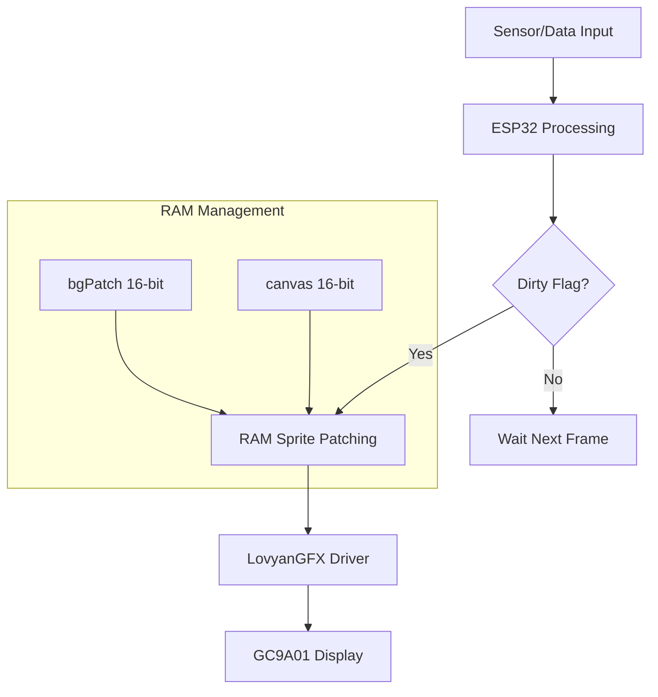

# SpeedoSmash: Evolusi Speedometer Suzuki Smash

**SpeedoSmash** adalah proyek pengembangan instrumen kluster digital kustom untuk motor (khususnya Suzuki Smash) menggunakan mikrokontroler ESP32 dan layar bulat GC9A01. Proyek ini bukan sekadar menampilkan angka, tapi merupakan eksperimen dalam mengoptimalkan performa grafis pada perangkat dengan sumber daya terbatas.


## 🛠️ Hardware & Stack

Sistem ini dibangun dengan komponen utama berikut:

- **Mikrokontroler:** ESP32 (Dual-core, 240MHz, 320KB SRAM).
- **Display:** GC9A01 1.28" Round LCD (240x240 pixels, SPI).
- **Library Grafis:** [LovyanGFX](https://github.com/lovyan03/LovyanGFX) (High-performance graphics driver).
- **Penyimpanan:** LittleFS (Flash file system untuk menyimpan aset `.raw` dan font `.vlw`).

## 📐 Arsitektur Sistem

Data mengalir dari sensor (simulasi/sensor fisik) melalui pemrosesan di ESP32 sebelum akhirnya dirender ke layar menggunakan teknik *buffering*.



## 🚀 Perjalanan Pengembangan (Trial & Error)

Membangun speedometer digital pada mikrokontroler jauh lebih rumit daripada membuat aplikasi web. Berikut adalah fase-fase kritis dalam pengembangan SpeedoSmash:

### Fase 1: Masalah "Black Box" & Anti-Aliasing
Awalnya, teks digambar langsung ke layar di atas gambar background. Namun, karena layar SPI bersifat *Write-Only* (tidak bisa dibaca balik), library tidak bisa melakukan pencampuran warna (*alpha blending*). Hasilnya, teks yang seharusnya halus (Anti-Aliased) malah memiliki kotak hitam di belakangnya.

### Fase 2: Tantangan Limitasi RAM
Layar 240x240 16-bit membutuhkan buffer sebesar **115KB**. ESP32 secara teori memiliki 320KB RAM, namun karena fragmentasi, sistem sering mengalami `Core Panic` saat mencoba mengalokasi buffer layar penuh.

> **Pelajaran:** Jangan pernah mencoba mengalokasi sprite seukuran layar penuh di ESP32 jika sudah menggunakan library besar lainnya.

### Fase 3: Solusi "Area Patching"
Kami menemukan solusi "Jalan Ninja": **Hanya simpan area yang berubah**. 
Elemen seperti angka kecepatan hanya berada di area tengah layar (Y=15 sampai Y=195). Dengan membatasi tinggi sprite menjadi 180 pixel, kami menghemat RAM secara signifikan tanpa mengorbankan kualitas visual.


## 💡 Fitur Utama

SpeedoSmash memiliki tiga mode utama yang dapat berganti secara dinamis:

1.  **Riding Mode:** Fokus pada visibilitas kecepatan jumbo, jam, dan tanggal.
2.  **Trip Computer:** Menampilkan jarak tempuh (Trip A/B), durasi perjalanan, dan rata-rata kecepatan.
3.  **Diagnostic:** Menampilkan voltase aki (real-time) serta catatan Max Speed dan Max RPM.

## 🛠️ Optimasi Performa (Deep Dive)

Untuk mencapai performa yang *smooth* (sekitar 15-20 FPS), beberapa teknik optimasi diterapkan:

### Dirty Flag & Cache System
Sistem hanya akan melakukan render ulang jika data berubah (`dataChanged == true`). Jika kecepatan tetap di 0 km/jam, ESP32 tidak perlu membuang daya komputasi untuk menggambar ulang.

### RAM Font Caching
Membaca file font dari LittleFS (Flash) di setiap frame adalah penyebab utama *stuttering*. Kami melakukan *caching* font kecil langsung ke RAM (Heap) saat *startup*.

```cpp
// Contoh loading font ke RAM buffer
uint8_t* buffer = (uint8_t*)malloc(size);
file.read(buffer, size);
canvas.loadFont(buffer); // Drawing dari RAM = Instan!
```

## 📖 Cara Penggunaan

### Prasyarat
- PlatformIO atau Arduino IDE.
- File sistem LittleFS yang sudah terisi aset di folder `/data`.

### Instalasi
1. Clone repositori ini.
2. Konfigurasi pin SPI di `DisplayConfig.h`.
3. Upload kode dan upload LittleFS Data.

## 🔮 Rencana Masa Depan
- [ ] Implementasi animasi Gear aktif dengan efek *scrolling*.
- [ ] Konektivitas Bluetooth untuk notifikasi pesan/telepon.
- [ ] Integrasi sensor Hall Effect fisik untuk pembacaan kecepatan asli.

---
*SpeedoSmash didokumentasikan oleh **Alvito.dev** sebagai bagian dari portofolio Embedded Systems.*
